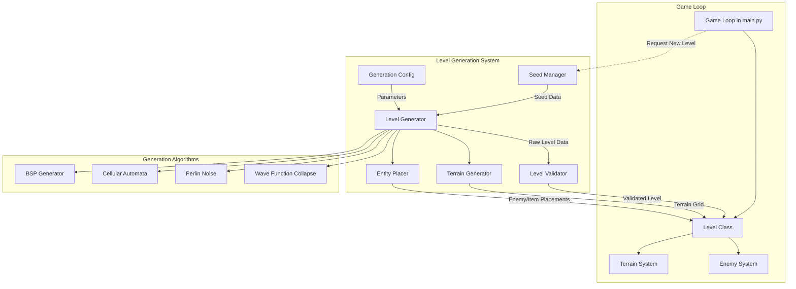
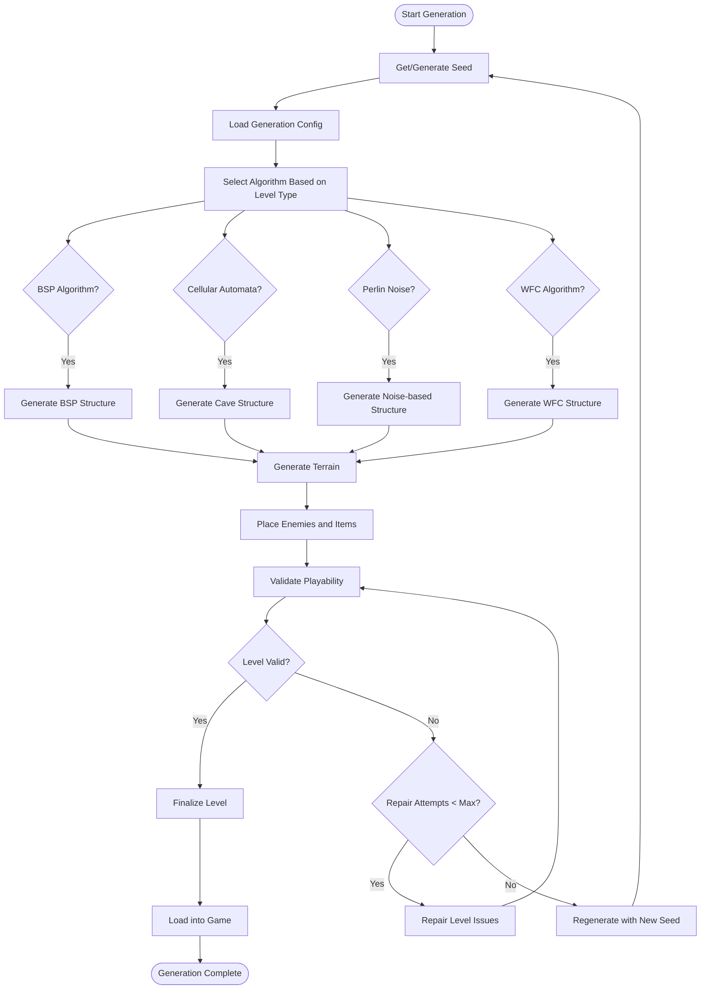
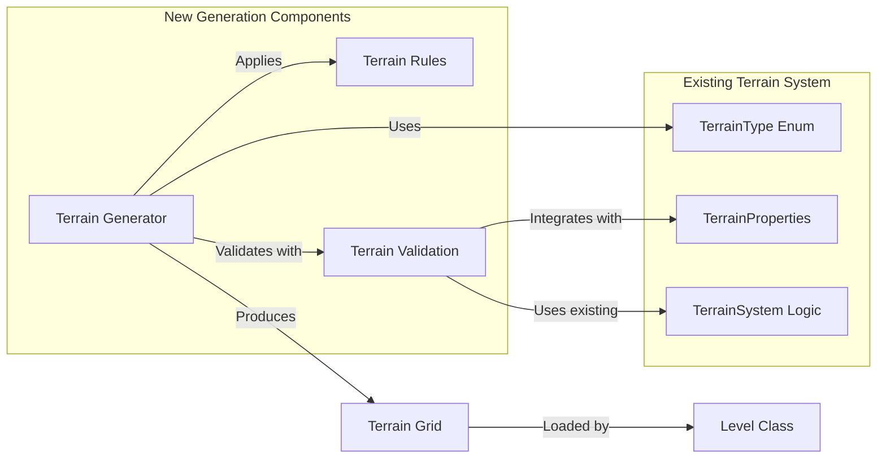
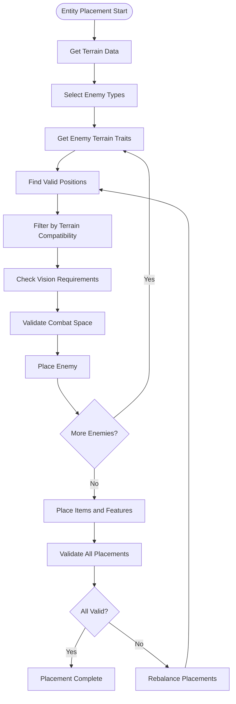
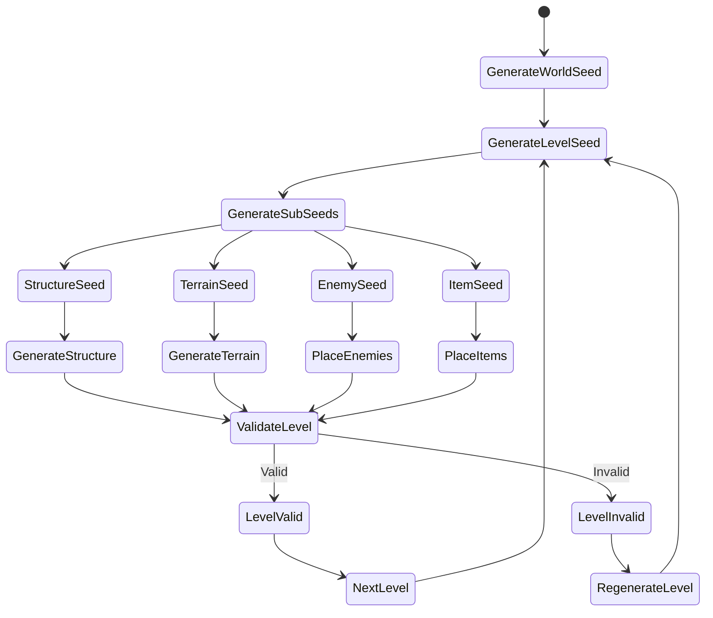
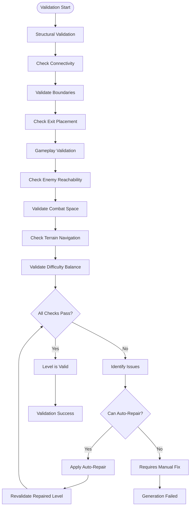
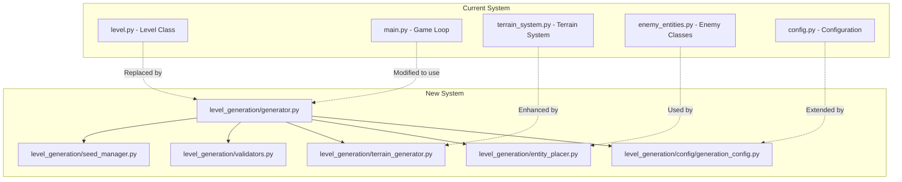
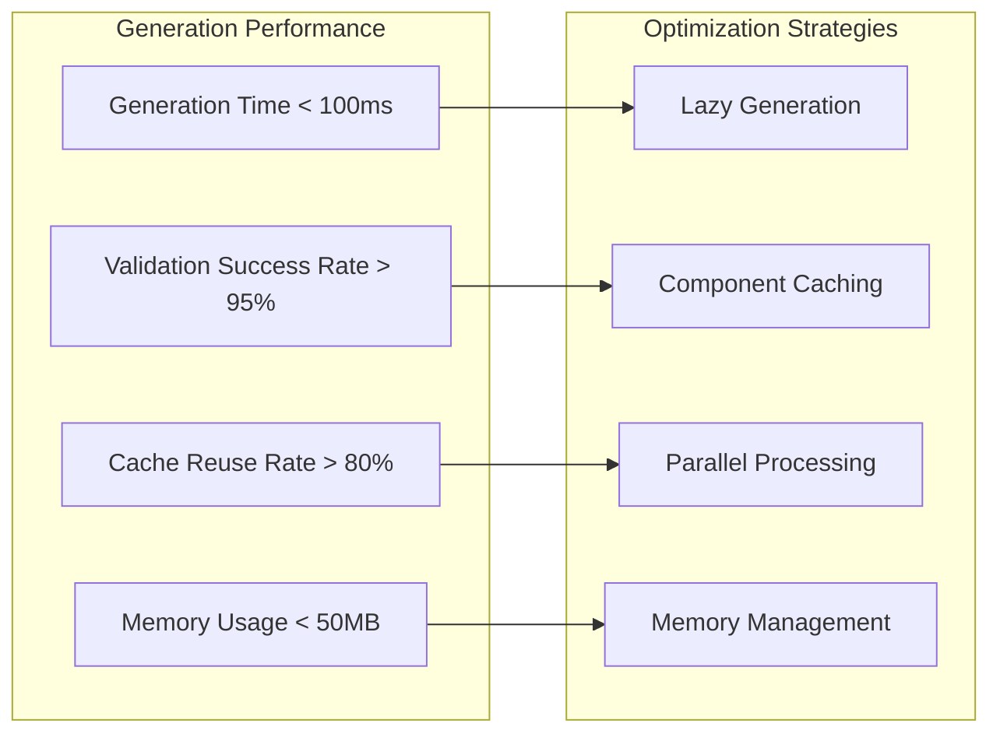

# Level Generation System Flow Diagram

## System Architecture Overview



## Generation Pipeline Flow



## Terrain Integration Flow



## Entity Placement Flow



## Seed Management Flow



## Validation System Flow



## Integration Points with Existing Code



## Performance Considerations



## Migration Timeline

```mermaid
gantt
    title Level Generation Migration Timeline
    dateFormat  YYYY-MM-DD
    section Phase 1: Foundation
    Seed Manager        :p1-1, 2024-01-01, 7d
    Basic Generator      :p1-2, after p1-1, 7d
    Level Integration    :p1-3, after p1-2, 7d
    
    section Phase 2: Core Generation
    Terrain System       :p2-1, after p1-3, 7d
    Entity Placement     :p2-2, after p2-1, 7d
    Validation Pipeline  :p2-3, after p2-2, 7d
    
    section Phase 3: Advanced Features
    Multiple Algorithms  :p3-1, after p2-3, 7d
    Difficulty Scaling   :p3-2, after p3-1, 7d
    Special Features     :p3-3, after p3-2, 7d
    
    section Phase 4: Polish
    Testing & Balancing :p4-1, after p3-3, 14d
    Optimization        :p4-2, after p4-1, 7d
    Documentation       :p4-3, after p4-2, 7d